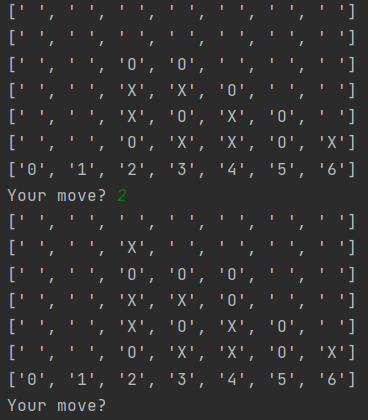

## CONNECT FOUR GAME

---
### MONTE CARLO METHOD

This game was built using Monte carlo method. It takes the current map, looks, which columns are free to make a move 
and for each of the free columns runs simulation N times, where randomly generates game till the end. Collects the 
states, when win gets plus points, draw also plus points but fewer than for a win adn when looses, gets minus points. 
After ass simulations takes as the next move the column with bigger points amount.

---

### GAME

play_game() is a main function which starts a game. In it there should be added a dict with key "to_move", 
where is added first player: X - player, O - AI. When it's player turn, the player would be asked for a column to 
move (0-1), before this, player would see the game map. After a player's move, there would be AI turn. The game ends
if player or AI put an identical symbol in a row by diagonal, horizontal or vertical. Also, if there would be no place 
to move, game ends with a draw.

Game screenshot:

---