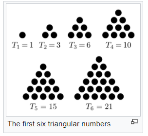

## N Queen problem

---
### Problem solving
Randomly places queens, saves them in list as tuples (x, y). Using hill climbing searches best place for one queen by checking all positions on the board. Value calculating gives to know if the place is the best place. Value is a number of crossed queen pairs. The code uses triangular number for value search. By the solving problem, the value decreases to 0. If value is 0, then problem is solved. If best move didn't decrease the value and it is not 0, then code restarts searching with new queens random positions. 
  
---
##### 100 times hill climbing restarts with different board sizes 
###### for 4x4: 
Time took for 100 launches: 0.06 seconds 
Time took on average for 1 launch: 0.0006 seconds 
Refreshes on average for 1 launch: 2.54 times 
###### for 8x8: 
Time took for 100 launches: 2.14 seconds 
Time took on average for 1 launch: 0.0214 seconds 
Refreshes on average for 1 launch: 7.46 times 
###### for 12x12: 
Time took for 100 launches: 38 seconds 
Time took on average for 1 launch: 0.38 seconds 
Refreshes on average for 1 launch: 26.19 times 
###### for 15x15: 
Time took for 100 launches: 1 minute and 30 seconds 
Time took on average for 1 launch: 0.9 seconds 
Refreshes on average for 1 launch: 26.95 times 
###### for 20x20: 
Time took for 100 launches: 8 minutes and 54 seconds 
Time took on average for 1 launch: 5 seconds 
Refreshes on average for 1 launch: 54.56 times 
###### for 30x30: 
Time took for 100 launches: 1 hour, 42 minutes and 44 seconds 
Time took on average for 1 launch: 1 minute and 2 seconds 
Refreshes on average for 1 launch: 105.09 times 
---
