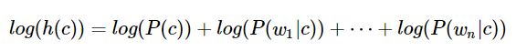

### Assigning article topics

###### First using train() method there would be divided words by topics, so we know how much each topic contain words, which words and how many of them repeats, storing them in maps. Then, using test() method it takes articles, and see for which topic words in article suits best, by calculating probability for each of them. If the topic was wrong, then there would be printed in a console that the mistake was made. For 100 articles, 96 was given right topic.

##### Using formula below, we calculate probability for each of the topic and the topic with higher probability would be chosen as article topic:

#####Here, _P(c)_ is the probability that the topic of the article is c, and _P(wi|c)_ is the probability that the word _wi_ appears in the text for topic _c_.

- Nw,c - the number of occurrences of the word w in articles on topic c
- Nc - the total number of words c in the topic articles
- |V| - number of unique words

##### As numbers are small, we use logarithms 
